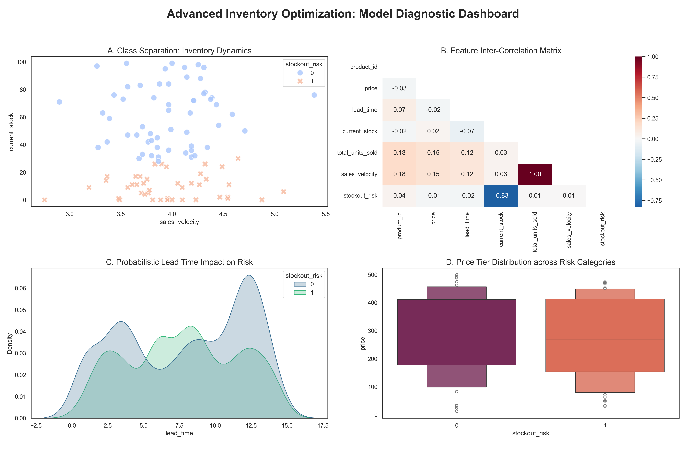

# 📦 Inventory Analytics & Forecasting Engine

An end-to-end data pipeline built to automate inventory auditing and forecast stockout risks using **SQL**, **Python**, and **Seaborn**.

## 🚀 Key Features
* **SQL Relational Engine:** 
Manages 12,000+ transaction rows across normalized tables.
* **Multi-Model Pipeline:** 
Compares Logistic Regression, Random Forest, and Linear Regression.
* **Clean Data Ops:** 
Professional-grade cleaning of missing prices and negative stock using Pandas.
* **Visual Analytics:** 
Diagnostic dashboard featuring correlation heatmaps and accuracy comparisons.

## 📊 Execute Pipeline
Run the following scripts in order:

1. **Build SQL Database:** 
`python src/1_generate_db.py`
2. **Clean & Join Data:** 
`python src/2_clean_data.py`
3. **Train ML Models:** 
`python src/3_train_model.py`
4. **Generate Visuals:** 
`python src/4_visualize_results.py`

## 📉 Diagnostic Dashboard

## 🛠️ Tech Stack
* **Database:** SQL (SQLite)
* **ML Ops:** Scikit-Learn
* **Visualization:** Seaborn, Matplotlib